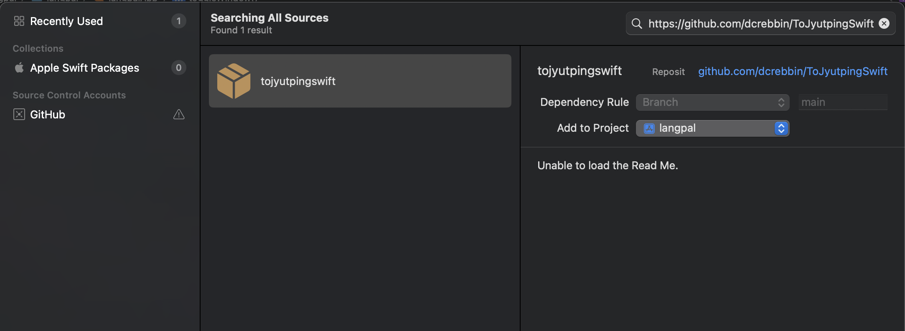

# To Jyutping for Swift

## 粵語拼音自動標註工具 Cantonese Pronunciation Automatic Labeling Tool

Derived from [to-jyutping (TypeScript)](https://github.com/CanCLID/to-jyutping) & [ToJyutping (python)](https://github.com/CanCLID/ToJyutping) from [CanCLID](https://github.com/canclid) (Cantonese Computational Linguistics Infrastructure Development Workgroup).

## Usage

1. In XCode, rigth click Package Dependencies and select "Add Package Dependencies"

2. Enter the package URL: `https://github.com/dcrebbin/ToJyutpingSwift`



3. In your Swift file, import the package:

```swift
import ToJyutpingSwift
```

4. Use the package to convert Chinese text to Jyutping:

```swift
let result = getJyutping("你好")  // "你(nei5)好(hou2)"
```
